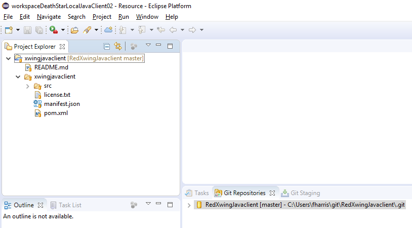
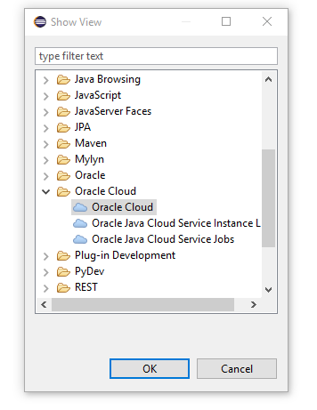
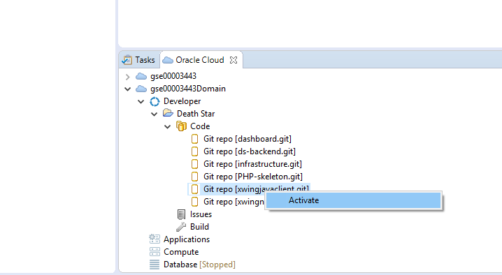

## CLONE CODE LOCALLY WITH ECLIPSE AND GIT ##

Open your Eclipse.
Go to Window-->Show View-->Other....

Choose
-->Git... and finally select the views # Git Repositories # and ## Git Staging ## :

Now, in the Git Repositories view, click: Clone a Git Repository.

In the following window select Clone URL and then past the URL from the repositories you're trying to clone locally. Don't forget the credentials for your user:

After selection the master repository, click Next and Finish. You now have the repository locally cloned:
In Eclipse, right-click the repository-->Import Projects...

Click Finish and you should now have your project created in Eclipse project explorer view.

### Next: First Mission ###

The code is cloned! You are ready to face your first mission! [click here](../missions/deploy.md) to start!

## USING GIT WITH ECLIPSE AND ORACLE CLOUD OEPE PLUGIN ##

This alternative is optional and if you followed the alternative in the previous point, you can ignore this and move on!

### Next: First Mission ###

The code is cloned! You are ready to face your first mission! [click here](../missions/deploy.md) to start!
