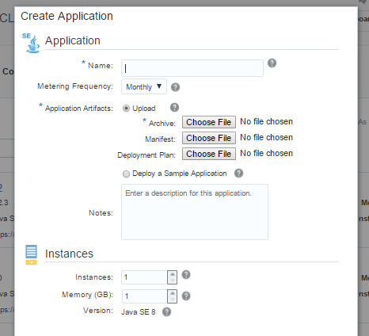

## Deploy Manually ##

If you are here is because you are a brave Xwing fighter and you dont need help of your R2D2 with the compilation and deployment.
So remember, depending on language you choose different sets of requirements you follow must! ;)

  Java: Maven and JDK installed

  Node.js: NPM installed

  PHP: Apache web server and PHP installed

At the end of the compilation process -regardless of language choosen - you should have a zip file containing the application and the  respective manifest.json file to proceed to deployment.

Too complex ??? Too boring ??? Change your deployment strategy and go for the automatic one! Click here !

If you are still convinced that the manual approach is the right one for you, go for it!!

## Using Application Container Cloud Service console to deploy ##

Here are the steps you'll need to follow:

1) Open the Oracle Application Container Cloud Service Applications page by going to the Dashboard of your Oracle Cloud My Services account.Open the Service Console.

2) Click Create Application.

3) Click an application type: Java SE, Node, or PHP.

4) Application Artifacts: These are the available options for identifying the application archive location:
Upload — Navigate to and upload your application archive and optionally a manifest file or deployment file. Click Browse to upload each of these files. Specifying a manifest file is required if your application archive doesn’t include this file.

IF MANUALLY ALWAYS USE THE SAME NAME!

